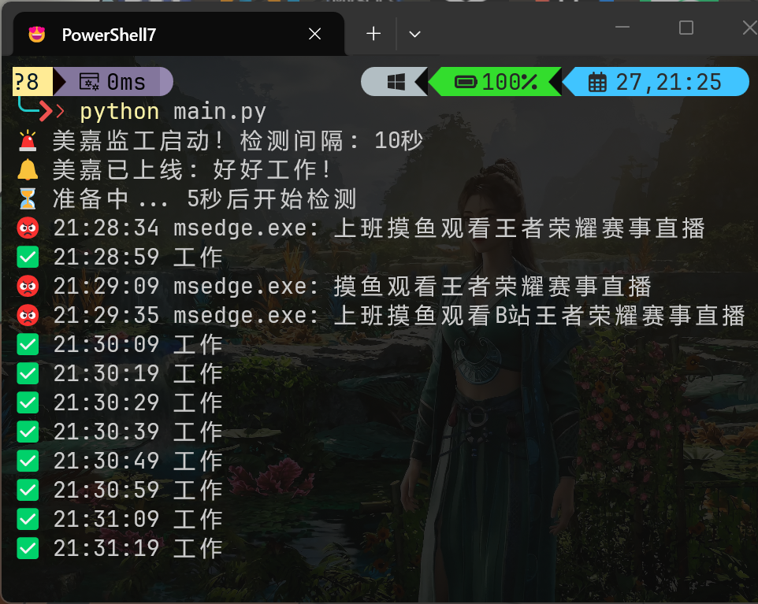
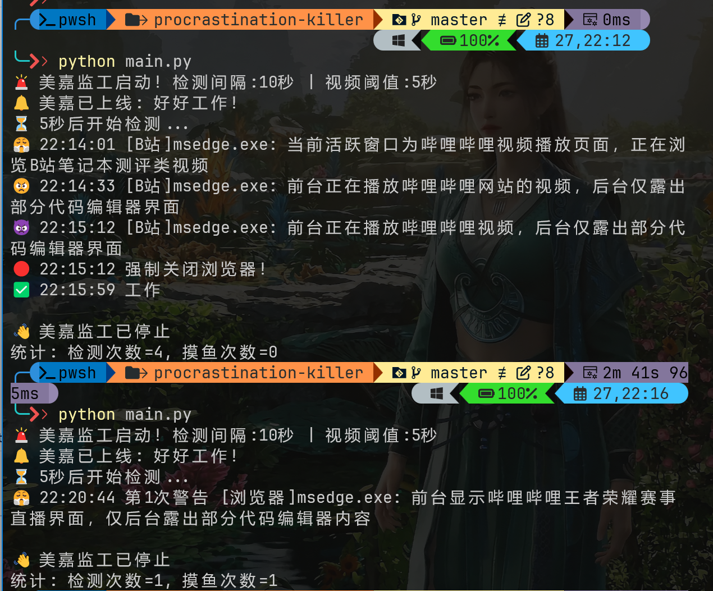

# 🎯 反拖延监工 Agent

一个基于 AI 的 Windows 桌面监工，帮你告别摸鱼！




## 功能特性

- 📸 每隔 10 秒截图分析屏幕
- 🤖 调用 Doubao-seed-2.0 AI 判断工作/摸鱼状态  
- 💬 毒舌吐槽督促你工作（按类型多样化）
- 🔊 Windows 原生语音提醒
- 😤😡🤬 三次警告递增（表情+文字）
- 🔴 三振出局：连续摸鱼 3 次强制关闭浏览器

## 环境配置

### 1. 安装 Python 依赖

```bash
# 使用 pip 安装
pip install volcengine-python-sdk[ark] Pillow psutil pywin32 pyttsx3 pydantic python-dotenv httpx

# 或使用 uv（更快）
uv pip install volcengine-python-sdk[ark] Pillow psutil pywin32 pyttsx3 pydantic python-dotenv httpx
```

### 2. 配置 API Key

火山方舟申请 API Key：[https://www.volcengine.com/](https://www.volcengine.com/)

```bash
# 复制配置模板
copy .env.example .env

# 编辑 .env，填入你的 ARK_API_KEY
```

`.env` 文件内容：
```env
ARK_API_KEY=你的API Key
ARK_MODEL=doubao-seed-2-0-pro-260215
```

### 3. 运行

```bash
python main.py
```

### 4. 后台运行（可选）

```bash
# 启动
start.bat

# 停止  
stop.bat
```

## 配置说明

| 变量 | 说明 | 默认值 |
|------|------|--------|
| ARK_API_KEY | 火山方舟 API Key | 必填 |
| CHECK_INTERVAL | 检测间隔（秒） | 10 |
| VIDEO_THRESHOLD | 看视频超时提醒（秒） | 5 |
| START_DELAY | 启动延迟（秒） | 5 |
| AI_NAME | AI 角色名 | 美嘉 |
| VOICE_NAME | Windows 语音 | Microsoft Huihui Desktop |

## 输出示例

### 正常工作
```
✅ 22:10:15 工作
✅ 22:10:27 工作
```

### 摸鱼检测
```
😤 22:10:15 第1次警告 [B站]msedge.exe: B站直播画面
🗣️ B站有什么好看的？代码写完再看！

😡 22:10:27 第2次警告 [B站]msedge.exe: KPL赛事直播
🗣️ 游戏重要还是KPI重要？

🤬 22:10:39 第3次警告 [B站]msedge.exe: 游戏直播
🗣️ 第3次了！关掉！别逼我动手！
🔴 22:10:40 强制关闭浏览器！
```

## 摸鱼类型识别

| 类型 | 关键词 | 吐槽示例 |
|------|--------|----------|
| B站 | bilibili, b站, KPL | B站有什么好看的？代码写完再看！ |
| YouTube | youtube | 油管视频那么好看？不如写代码！ |
| 游戏 | game, 游戏, 赛事 | 游戏重要还是KPI重要？ |
| 直播 | 直播 | 看直播能涨薪？ |
| 短视频 | 抖音, 快手 | 抖音刷不停？工作做完了？ |
| 音乐 | Spotify | 听歌干活？一心二用？ |

## 白名单

以下应用不会被判定为摸鱼：
- 终端：cmd.exe, WindowsTerminal.exe, PowerShell.exe
- 编辑器：Code.exe, OpenCode.exe, notepad.exe
- IDE：pycharm64.exe, idea64.exe, goland64.exe, devenv.exe

## 技术架构

- **阶段一 PERCEPTION**: 截图 + AI分析
- **阶段二 MEMORY**: 滑动窗口记忆（5条）
- **阶段三 EXPRESSION**: 多样化语音吐槽
- **阶段四 ENFORCEMENT**: 三振强制关闭
- **阶段五 DEPLOYMENT**: 后台运行脚本

## 鸣谢

- [火山引擎](https://www.volcengine.com/) - Doubao-seed-2.0 模型
- [pyttsx3](https://github.com/nateshmbhat/pyttsx3) - Windows 语音合成
- [psutil](https://github.com/giampaolo/psutil) - 进程管理